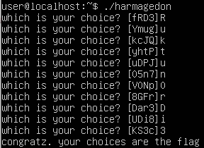

# harmagedon

### Binary

By removing the code of printing, choosing the characters, we can simplify this problem to math problem.

```python
v0 = 0
for _ in range(11):
    if v0 == 0xB77C7C:
        # need to reach here
        break
    ipt = select_0_to_3()
    v0 = 4 * (v0 + ipt + 1)
```

### Solution

We can easily know that we have to select number 11 times by bit length of `0xB77C7C`.

There is a recurrence relation of v0 and we know the depth. So, we can derive the formula of v0's value,


where  means i th input.

Whatever the  values are, there is  that always adds to v0.

```
0xB77C7C - 0x555554 = 0x622728
```

 are two bits value and  shifts left twice.

```
     ipt       1  2  3  4  5  6  7  8  9 10 11         
0x622728 = 0b 01 10 00 10 00 10 01 11 00 10 10 00
  choose       1  2  0  2  0  2  1  3  0  2  2
```



 