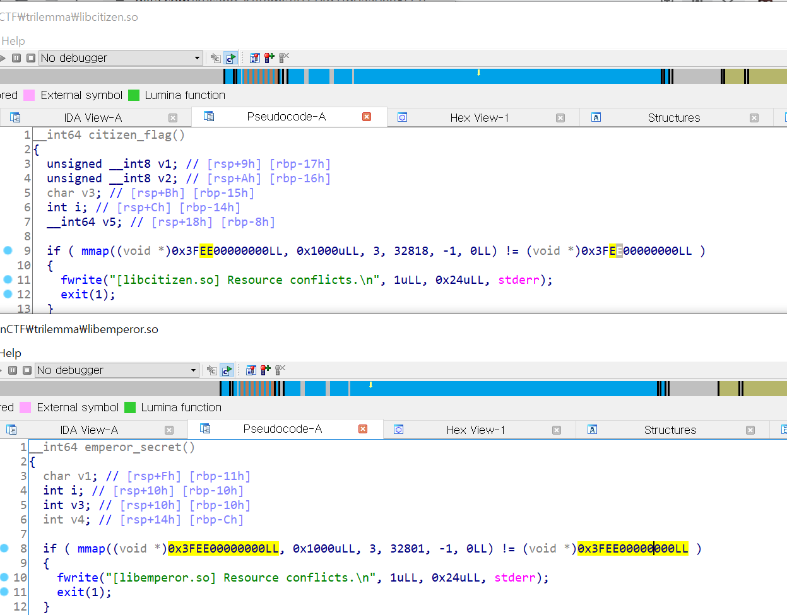

# trilemma

### Binary

We can see that libraries try `mmap` to same address. This is a problem that the compiled binary cannot prints the flag.



### Solution

Patch the mmap address(and some code that referencing the address) in the library. 

```bash
$ gcc main.c -L./ -lemperor -lcitizen -lslave
$ LD_LIBRARY_PATH=./ ./a.out
The flag is KosenCTF{emperor_wins_with_a_probability_of_four-fifths}
```

