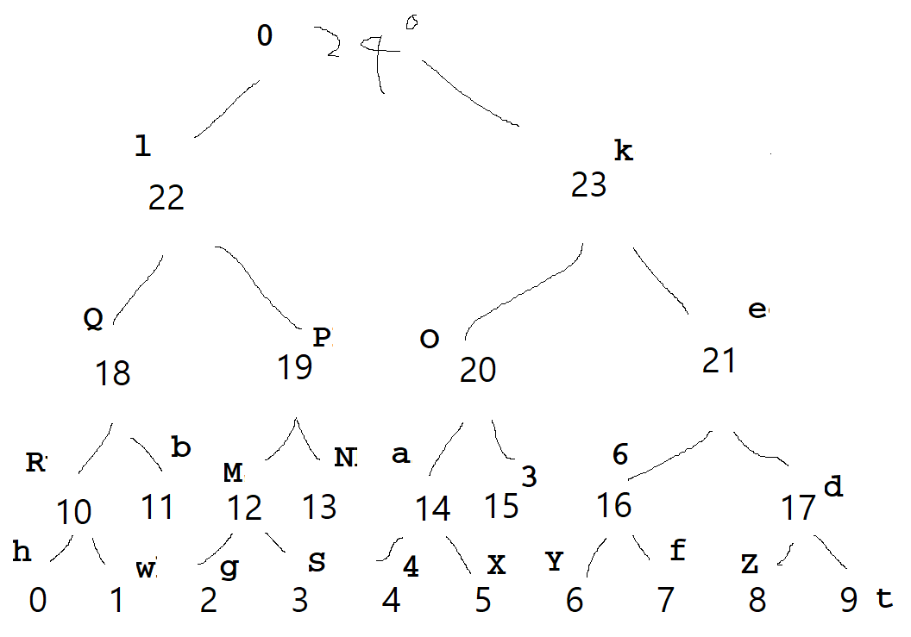

# REplica

### Binary

Rust binary, but not much to look at.

There are some code that allocate some memory, put data from input link to other allocated memory.

### Solution

Those input given at argv[1] is stored in some way without any additional computation, and just somehow compare with `0kedtZ6fYO3aX4lPNMSgQbRwh`.

The easiest way to solve this is looking at the values when comparing with my input and some other values.

So breakpoint at 0x949E and give an argument with `abcdefghijklmnopqrstuvwxy`.

```Breakpoint 2, 0x000055555555d49e in ?? ()
LEGEND: STACK | HEAP | CODE | DATA | RWX | RODATA
─────────────────────────────────[ REGISTERS ]──────────────────────────────────
 RAX  0x79
 ...
───────────────────────────────────[ DISASM ]───────────────────────────────────
 ► 0x55555555d49e    cmp    al, byte ptr [r13 + rdi]
────────────────────────────────────────────────────────────────────────────────
pwndbg> x/bx $r13 + $rdi
0x55555559d910:	0x30
```

Memory where 0x79(y) exists should be 0x30(0). Retry with `abcdefghijklmnopqrstuvwx0`.

Repeating this 25 times, will get a flag.

Or, you can just analyze it and get a binary tree. Here is my poor drawing.



```
❯ ./main_replica hwgS4XYfZtRbMNa36dQPOelk0                                                               1m 4s 02:00:07
m41n r3pl1c4
------------
yup: inctf{0lQRhwbPMgSNkOa4X3e6YfdZt}
```


